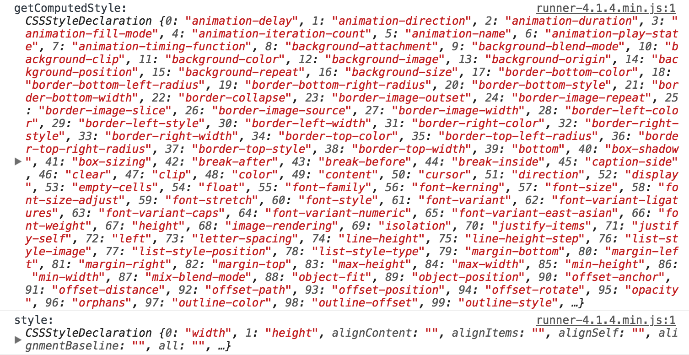

## 使用圆锥渐变和css变量创建一个range input控制的环形图

- 项目演示

## 关于`conic-gradient()`

- 圆锥渐变，类似以下的

  <div style="width: 200px">
    
  </div>

- 浏览器支持情况

  <div style="width: 750px">
    
  </div>

  还处在一个实验中的功能，如果想要使用，需要开启在[Chrome实验功能选项](chrome://flags/)：
  <div style="width: 500px">
    
  </div>

虽然圆锥渐变还处在实验中的功能，但不妨碍我们学习怎么去运用它，从而触及旁通。

## 梳理1-圆锥中间镂空的实现

如图所示，要实现的是一个圆环，怎么在中间设置一个遮罩层呢？
<div>
  
  =>
  
</div>

- 方法一，在 conic-gradient() 上再设置一层 background-image 进行遮罩，此处用 radial-gradient() 就行了
  设置`transparent 39.5%`是为了模糊锯齿
  ```stylus
    background-image radial-gradient(#3d3d4a 39%, transparent 39.5%), conic-gradient(#e64c65 calc(var(--val)*1%), #41a8ab 0%)
  ```

- 方法二，使用 CSS3 的新属性 mask，隐藏元素的部分区域。
  ```styl
    -webkit-mask: radial-gradient(transparent 39.5%, #3d3d4a 39%);
  ```

和方法一相比，mask可以使用图片遮罩元素的部分区域，扩展性高些。但IE和Opera都不支持mask属性

## 梳理2-伪元素的使用技巧

如demo，数字后面 % 的添加有各种方法，可以使用js添加。也可以使用伪元素添加，这在日常开发中是没有想到的

  ```styl
    &:after
      content '%'
  ```

## 梳理3-CSS属性 pointer-events

把元素设置为 `pointer-events none` ，除了指示该元素不是鼠标事件的目标之外，值none表示鼠标事件“穿透”该元素并且指定该元素“下面”的任何东西。

对于作为遮罩作用的元素，设置此属性可以避免覆盖了“下面”元素的事件，非常实用

参考：[pointer-events](https://developer.mozilla.org/zh-CN/docs/Web/CSS/pointer-events)

## 梳理4-判断浏览器是否支持某种CSS属性

例如要判断浏览器是否支持CSS的`conic-gradient`属性。可以使用`getComputedStyle()`：
```js
  if (getComputedStyle(domElement).backgroundImage !== 'none) {
    // 支持属性，相应的代码逻辑
  } else {
    // 不支持属性，相应的代码逻辑
  }
```

`getComputedStyle()`:
- 可以获取当前元素所有最终使用的CSS属性值
- 返回的是一个CSS样式声明对象([object CSSStyleDeclaration])，只读
- 两个参数，第一个参数：元素（必须），第二个参数：伪元素（非必须）

`getComputedStyle()`与`style`区别：
相同点：
- 返回的是CSS样式声明对象([object CSSStyleDeclaration])

不同点：
- `getComputedStyle()`是只读，`style`是可读可写
- `getComputedStyle()`获取的是最终应用在元素上的所有CSS属性对象（即使没有CSS代码，也会把默认的祖宗八代都显示出来）；而`element.style`只能获取元素style属性中的CSS样式

Demo: https://jsbin.com/mabitumeja/edit?html,js,output
```html
  <div id="styleTest" class="style-test" style="width: 200px; height: 200px"></div>
```
```styl
  .style-test
    background pink
```
```js
  window.onload=function() {
  const styleTest = document.getElementById('styleTest')

  console.log('getComputedStyle:', getComputedStyle(styleTest))
  console.log('style:', styleTest.style)
}
```
output:
<div style="width: 700px">
  
</div>

## 梳理5-js更改伪元素的样式

js操作Dom元素并不包括伪元素。如果想通过js修改伪元素的样式。可以使用`addRule()`的方法

```js
  document.styleSheets[0].addRule('output:before','transform:' + 'translate(0,' + rangeValue / -100 * (trackWidth - thumbDiameter) + 'px)')
```

第一个参数是伪元素，第二个参数是相应的样式


## 文档参考

- [张鑫旭，获取元素CSS值之getComputedStyle方法熟悉](http://www.zhangxinxu.com/wordpress/2012/05/getcomputedstyle-js-getpropertyvalue-currentstyle/)

- http://jdc.jd.com/archives/212063

- [原点辐射渐变radial-gradient](https://developer.mozilla.org/zh-CN/docs/Web/CSS/radial-gradient)

- [pointer-events](https://developer.mozilla.org/zh-CN/docs/Web/CSS/pointer-events)
