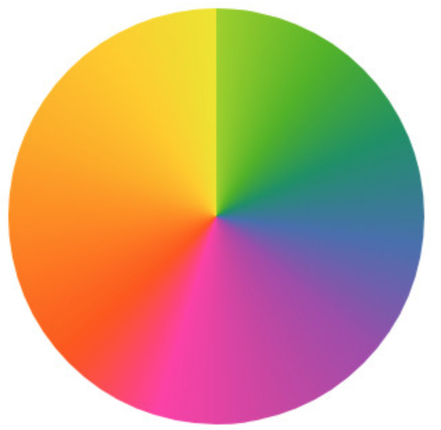
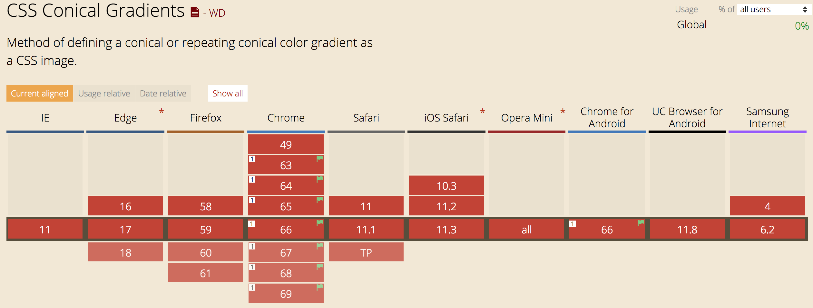
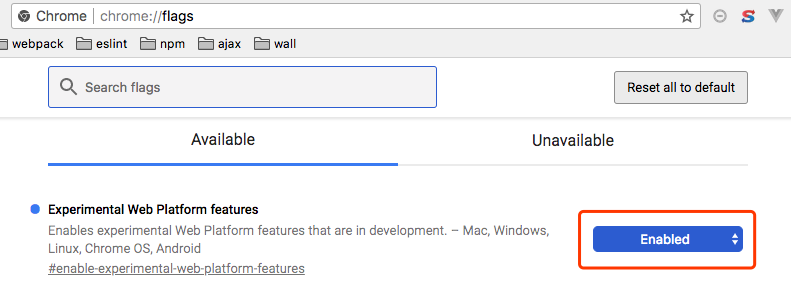
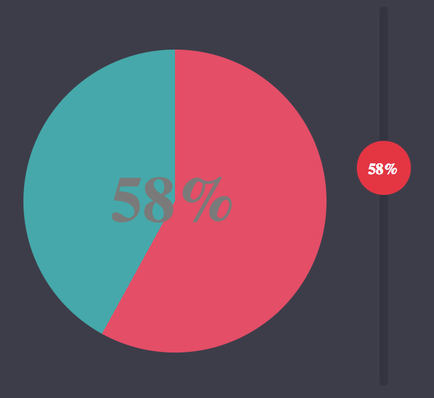
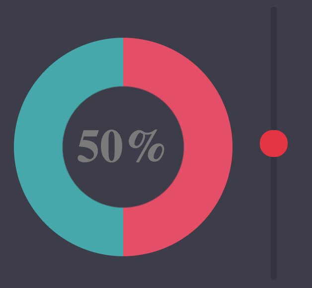

## 使用圆锥渐变和css变量创建一个range input控制的环形图

- 项目演示

## 关于`conic-gradient()`

- 圆锥渐变，类似以下的

  <div style="width: 200px">
    
  </div>

- 浏览器支持情况

  <div style="width: 750px">
    
  </div>

  还处在一个实验中的功能，如果想要使用，需要开启在[Chrome实验功能选项](chrome://flags/)：
  <div style="width: 500px">
    
  </div>

虽然圆锥渐变还处在实验中的功能，但不妨碍我们学习怎么去运用它，从而触及旁通。

## 梳理1-圆锥中间镂空的实现

如图所示，要实现的是一个圆环，怎么在中间设置一个遮罩层呢？
<div>
  
  =>
  
</div>

- 方法一，在 conic-gradient() 上再设置一层 background-image 进行遮罩，此处用 radial-gradient() 就行了
  设置`transparent 39.5%`是为了模糊锯齿
  ```stylus
    background-image radial-gradient(#3d3d4a 39%, transparent 39.5%), conic-gradient(#e64c65 calc(var(--val)*1%), #41a8ab 0%)
  ```

- 方法二，使用 CSS3 的新属性 mask，隐藏元素的部分区域。
  ```styl
    -webkit-mask: radial-gradient(transparent 39.5%, #3d3d4a 39%);
  ```

和方法一相比，mask可以使用图片遮罩元素的部分区域，扩展性高些。但IE和Opera都不支持mask属性


## 文档参考

- [张鑫旭，获取元素CSS值之getComputedStyle方法熟悉](http://www.zhangxinxu.com/wordpress/2012/05/getcomputedstyle-js-getpropertyvalue-currentstyle/)

- http://jdc.jd.com/archives/212063

- [原点辐射渐变radial-gradient](https://developer.mozilla.org/zh-CN/docs/Web/CSS/radial-gradient)
